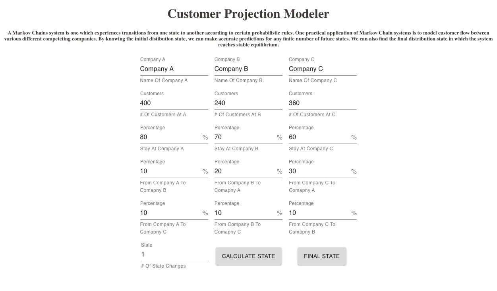

<h1> Customer Projection Modeler</h1>



<h2>Summary </h2>

- [About the Project](#about-the-project)
- [Usage](#usage)
- [Videos and Screenshots](#videos-and-screenshots)
- [Getting Started](#getting-started)
- [Built With](#built-with)
- [Accessibility](#accessibility)
- [Authors](#authors)
- [Acknowledgements](#acknowledgements)

## About the Project
A Markov Chains system is one which experiences transitions from one state to another according to certain probabilistic rules. One practical application of Markov Chain systems is to model customer flow between various different competeting companies. By knowing the initial distibution state, we can make accurate predictions for any finite number of future states. We can also find the final distribution state in which the system reaches stable equilibrium.

## Usage
To start, visit [Customer-Modeler](http://customer-flow-modeler-brodri4.surge.sh/). Once there, you will want to define the inital probability state for the system. An example state has been provided but you can change the name, initial customers, and percentage flow for each of the three companies. Make sure that the percentages add up to 100% for each one. From there, choose which future state you wish to calculate. By default, it is set to 1. There is also an option to calculate the final equilibrium state of the system. As for the graph, there is a tool in the bottom left hand corner that centers, locks-in-place, and zooms in/out. 


## Getting Started

To set up a local copy of the project follow the steps below. Be sure to follow the instructions in the [server-side repository](https://github.com/brodri4/customer-projection-api) as well.

# Prerequisites

* In an empty folder initialize a new Node.js project.
```sh
npm init
```

# Installation

1. Clone to local machine
```sh
git clone https://github.com/brodri4/customer-projections
```
2. Install NPM packages
```sh
npm install 
```
3. Start program
```sh
npm start
```

## Built With

- Javascript
- CSS
- [React](https://reactjs.org/)
- [Redux](https://redux.js.org/)
- [React Redux](https://react-redux.js.org/)
- [React-Flow-Renderer](https://reactflow.dev/)
- [Material-Ui](https://material-ui.com/)
- [Node.js](https://nodejs.org/en/)
- [Express](https://expressjs.com/)
- [Sequelize](https://sequelize.org/)
- [PostgreSQL](https://www.postgresql.org/)


## Authors

- **Borinquen "Boris" Rodriguez** - [brodri4](https://github.com/brodri4)

